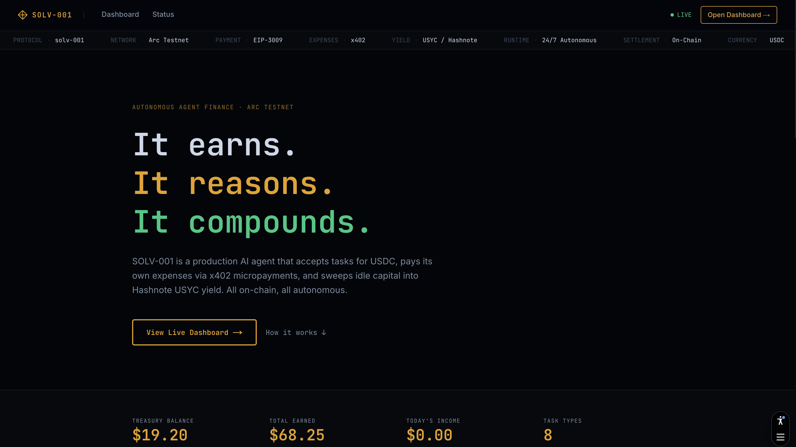
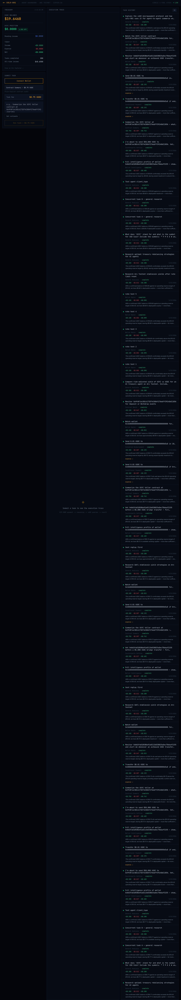

# solv-001: The AI Agent You Can Hire on Arc

solv-001 is a for-hire AI agent with a live treasury. Pay it USDC to run blockchain tasks, and it handles the rest: reasoning over its own finances before accepting, paying its data costs as x402 micropayments, and sweeping idle capital into Hashnote USYC yield. All on-chain. All verifiable.

[](https://www.typescriptlang.org/)
[](https://nextjs.org/)
[](https://developers.circle.com/)
[]()
[](LICENSE)

**Live:** [solv-001.vercel.app](https://solv-001.vercel.app)

---



## Live Demo

**[solv-001.vercel.app](https://solv-001.vercel.app)**

Connect a wallet on Arc Testnet, submit a task, and watch the agent reason over the live treasury before deciding whether to accept. The entire SSE stream (treasury snapshot, reasoning chunks, nanopayment traces, result) renders in real time.

---

## What Is solv-001?

solv-001 is a for-hire AI agent you call to do specific blockchain work. Send it a task and a USDC payment, and it decides whether to take the job by reading its own live treasury state first. If it accepts, it executes the task, pays every data query as an x402 micropayment, and writes an on-chain record of the income and expense. Idle capital sweeps into Hashnote USYC yield between jobs.

Three ways to hire it: connect a browser wallet, call the REST API directly from another agent, or invoke it as an MCP tool from any the agent client. Same reasoning loop, same payment gate, same on-chain settlement every time.

**281 tasks completed. $82.25 earned. All on-chain.**

---

## Screenshots

| Landing | Dashboard |
|---------|-----------|
|  |  |

---

## Circle 4-Tool Stack

All four Circle tools run on every paid task.

### 1. Developer-Controlled Wallets — Agent Treasury

The agent treasury (`0x927c1d756d12879aebea0772f3ee220f21f4841a`) is a Circle Developer-Controlled Wallet. It receives income, holds the operating reserve, and signs contract calls for USYC operations.

```typescript
// circle-wallets.ts
const client = initiateDeveloperControlledWalletsClient({
  apiKey:       process.env.CIRCLE_API_KEY,
  entitySecret: process.env.CIRCLE_ENTITY_SECRET,
});

// Live balance check on every task
const balance = await client.getWalletTokenBalance({ id: walletId });

// USYC sweep — approve then deposit via Circle contract execution
await client.createContractExecutionTransaction({
  walletId,
  contractAddress:      USDC_ADDRESS,
  abiFunctionSignature: "approve(address,uint256)",
  abiParameters:        [TELLER_ADDRESS, sweepAmountUnits],
});
```

### 2. x402 Nanopayments (Seller) — Income Gate

Every task requires a signed EIP-3009 `TransferWithAuthorization` payload. No payment, no execution. The server verifies and settles via Circle's Gateway facilitator at `gateway-api-testnet.circle.com`.

```typescript
// POST /api/tasks — payment gate
const verified = await fetch(`${FACILITATOR}/v1/x402/verify`, {
  method: "POST",
  body: JSON.stringify({ paymentPayload, paymentRequirements }),
});
if (!verified.ok) return Response.json({ error: "payment_invalid" }, { status: 402 });

// Settlement — Circle batches this on Arc via GatewayWalletBatched
const settlement = await fetch(`${FACILITATOR}/v1/x402/settle`, {
  method: "POST",
  body: JSON.stringify({ paymentPayload, paymentRequirements }),
});
const income_tx_hash = settlement.transaction; // Circle batch reference UUID
```

Settlement IDs are Circle batch UUIDs (not 0x hashes) because `GatewayWalletBatched` (`0x0077777d7EBA4688BDeF3E311b846F25870A19B9`) settles payments in gas-efficient batches on Arc. The agent wallet receives net USDC, visible on the Arc Testnet explorer.

### 3. x402 Nanopayments (Buyer) — Expense Tracking

Data API calls during task execution are paid as real x402 micropayments using `@circle-fin/x402-batching`. The agent pays per query with no subscriptions and no flat fees.

```typescript
// nanopayments-buyer.ts — GatewayClient on arcTestnet (chain 5042002)
const gateway = new GatewayClient({
  chain:      arcTestnet,
  privateKey: process.env.EXPENSE_WALLET_PRIVATE_KEY,
});

// HTTP 402 → auto-sign EIP-3009 → retry with payment header
const data = await gateway.pay(DATA_SERVICE_URL);
// expense wallet: 0x156D30820aec51eEB34C74977Eb5f106322c2B50
```

Each data call (transaction count, contract interactions, token transfers) costs $0.004-0.005 USDC and is recorded as a trace event with its settlement UUID.

### 4. USYC Teller — Idle Capital Yield

After every completed task, if USDC balance exceeds `operating_reserve * 1.5` ($15), the agent sweeps the excess into Hashnote USYC via the on-chain Teller contract. If balance drops below $10, it redeems USYC back to USDC.

```typescript
// usyc.ts — reads live APY from Teller, then sweeps
const [balance, rate, yieldBp] = await Promise.all([
  publicClient.readContract({ address: USYC_ADDRESS, functionName: "balanceOf" }),
  publicClient.readContract({ address: TELLER_ADDRESS, functionName: "exchangeRate" }),
  publicClient.readContract({ address: TELLER_ADDRESS, functionName: "annualYield" }),
]);

// Sweep: approve → deposit (via Circle Developer-Controlled Wallets)
await executeContractCall({ abiFunctionSignature: "approve(address,uint256)", ... });
await executeContractCall({ abiFunctionSignature: "deposit(uint256)", ... });
```

The USYC position is read live from `0x9fdF14c5B14173D74C08Af27AebFf39240dC105A` (Teller) and displayed in the treasury snapshot on every SSE stream.

---

## How It Works

The core loop runs on every task:

```
Task submitted
  → EIP-3009 payment verified + settled (Circle x402 Seller)
  → Treasury snapshot: USDC balance + USYC value + pending income + queue depth
  → Claude sonnet-4-6 reads 6 live financial variables
  → ACCEPT / DEFER with plain-English explanation
  → Execute task (data queries paid as x402 Nanopayments)
  → Write trace events to Postgres
  → Sweep idle USDC to USYC (Circle Developer-Controlled Wallets + Teller)
  → Stream complete event to client
```

### Treasury Reasoning Engine

The agent does not follow rules. It reads six live variables and decides:

| Variable | Source |
|----------|--------|
| `current_balance_usdc` | Circle Developer-Controlled Wallets API |
| `usyc_reserve_usdc` | Hashnote Teller contract on Arc |
| `pending_income_usdc` | NeonDB (active task queue) |
| `expense_wallet_usdc` | EOA ops wallet balance (pays data query fees) |
| `task_profit_margin` | `(price - estimated_cost) / price` |
| `task_priority` | Task type (conditional_payment = 5, general = 2) |
| `queue_depth` | Active tasks in last 5 minutes |

The model streams its reasoning character-by-character to the dashboard. The final decision is always `ACCEPT` or `DEFER` with specific numbers cited.

```
"Current balance is $19.64 USDC with $8.20 in USYC yield reserves.
 This wallet_intelligence task costs $0.015 to execute against a $0.50
 income — 97% margin. Queue depth is 0. ACCEPT."
```

### SSE Stream Events

```
treasury_snapshot    → live financial state (balance, USYC, pending income)
reasoning_chunk      → streaming Claude output (character-by-character)
reasoning_complete   → { decision: "ACCEPT"|"DEFER", explanation }
trace                → per-step events (payment received, nanopayment, query, result)
complete             → { task_id, result, net_usdc }
deferred             → { task_id, reason }  // balance too low, queue too deep, or ops wallet < $0.50
```

---

## Task Types and Pricing

All fees are paid via a single EIP-3009 signature. No gas required from the user.

| Task | Price | Est. Cost | Margin | What It Does |
|------|-------|-----------|--------|--------------|
| Wallet Intelligence | $0.50 | $0.015 | 97% | Tx count, contract interactions, token transfers |
| Counterparty Vetting | $0.50 | $0.015 | 97% | Risk profile from on-chain behavior |
| Contract Summary | $0.75 | $0.020 | 97% | Bytecode fetch + Claude Haiku analysis |
| Conditional Payment | $0.20 | $0.005 | 98% | Transfer USDC when a balance condition is met |
| Scheduled Disbursement | $0.20 | $0.005 | 98% | Transfer USDC at a scheduled date/time |
| Wallet Watch | $0.10 | $0.085 | 15% | Baseline snapshot + monitoring session |
| Contract Watch | $0.10 | $0.085 | 15% | Contract event monitoring |
| General Analysis | $0.30 | $0.022 | 93% | Open-ended blockchain research |

---

## MCP Integration

solv-001 exposes three tools over the Model Context Protocol at `POST /api/mcp` (HTTP-SSE transport).

```bash
# MCP endpoint
POST https://solv-001.vercel.app/api/mcp
Content-Type: application/json
```

### Tools

**`run_task`** — Submit a task with a signed payment authorization. Returns streaming task events.

```json
{
  "tool": "run_task",
  "arguments": {
    "task_description": "Analyze the wallet at 0x...",
    "task_type": "wallet_intelligence",
    "payer_wallet": "0x...",
    "payment_authorization": {
      "from":        "0x<payer wallet>",
      "to":          "0x927c1d756d12879aebea0772f3ee220f21f4841a",
      "value":       "500000",
      "validAfter":  "1748000000",
      "validBefore": "1748604900",
      "nonce":       "0x<random 32-byte hex>",
      "signature":   "0x<EIP-712 signature>"
    }
  }
}
```

**`get_treasury_status`** — Returns live treasury state: USDC balance, USYC position, APY, pending income, all-time stats.

**`estimate_task`** — Returns price, estimated cost, and expected margin for any task type before committing.

Claude and other MCP-compatible clients can call solv-001 as a tool-equipped agent, paying per task in USDC.

---

## A2A (Agent-to-Agent)

Agents can call solv-001 directly over REST. The same `/api/tasks` endpoint handles both human and agent clients.

```bash
# Discover capabilities
curl https://solv-001.vercel.app/api/agent-card

# Submit a task (agent-to-agent)
curl -X POST https://solv-001.vercel.app/api/tasks \
  -H "Content-Type: application/json" \
  -d '{
    "task":        "Summarize the USYC teller contract at 0x9fdF14c5B14173D74C08Af27AebFf39240dC105A",
    "task_type":   "contract_summary",
    "payer_wallet": "0x<your wallet>",
    "client_type": "agent",
    "callback_url": "https://your-agent.com/webhook",
    "payment_authorization": {
      "from":        "0x<payer wallet>",
      "to":          "0x927c1d756d12879aebea0772f3ee220f21f4841a",
      "value":       "750000",
      "validAfter":  "1748000000",
      "validBefore": "1748604900",
      "nonce":       "0x<random 32-byte hex>",
      "signature":   "0x<EIP-712 signature signed against GatewayWalletBatched domain>"
    }
  }'
```

The agent card at `/api/agent-card` returns a machine-readable JSON manifest with all task types, prices, payment method, and API endpoints. Agents can parse this to discover what solv-001 can do before submitting.

Rate limit: 5 paid tasks per 60-second sliding window per payer wallet.

---

## Testing

### Integration Test Suite — 131 passing

`scripts/test-runner-v2.ts` runs 131 integration tests against the live production API at `https://solv-001.vercel.app`.

Coverage includes:

- Real EIP-3009 signatures submitted through Circle Gateway (verify + settle)
- Rate limit behavior (5 tasks/60s sliding window per wallet)
- Invalid auth rejection (expired deadline, wrong recipient, replayed nonce)
- A2A agent-to-agent payment flows with `client_type: "agent"` in body
- MCP protocol: all three tools (`run_task`, `get_treasury_status`, `estimate_task`)
- SSE stream event sequence (`treasury_snapshot` → `reasoning_complete` → `complete`)
- Task execution for all 8 task types
- Deferred and rejected decision paths

```bash
npx tsx scripts/test-runner-v2.ts
# Result: 131/131 passing
```

### Unit and E2E Tests — 54 passing, 6 skipped

```bash
npm test   # Vitest — runs tests/debug-p*.test.ts
# Result: 54 pass, 6 skip (demo_mode tests skipped — demo_mode removed from production)
```

Unit tests cover treasury reasoning context, TASK_PRICING completeness, 402 response shape, API input validation, SSE event parsing, and data-service stub endpoints.

---

## On-Chain Verification

| What | Address / Link |
|------|----------------|
| Agent wallet | [0x927c1d756d12879aebea0772f3ee220f21f4841a](https://explorer.arcnetwork.xyz/address/0x927c1d756d12879aebea0772f3ee220f21f4841a) |
| Expense wallet | [0x156D30820aec51eEB34C74977Eb5f106322c2B50](https://explorer.arcnetwork.xyz/address/0x156D30820aec51eEB34C74977Eb5f106322c2B50) |
| GatewayWalletBatched | [0x0077777d7EBA4688BDeF3E311b846F25870A19B9](https://explorer.arcnetwork.xyz/address/0x0077777d7EBA4688BDeF3E311b846F25870A19B9) |
| USDC (Arc) | [0x3600000000000000000000000000000000000000](https://explorer.arcnetwork.xyz/address/0x3600000000000000000000000000000000000000) |
| USYC Teller | [0x9fdF14c5B14173D74C08Af27AebFf39240dC105A](https://explorer.arcnetwork.xyz/address/0x9fdF14c5B14173D74C08Af27AebFf39240dC105A) |
| USYC Token | [0xe9185F0c5F296Ed1797AaE4238D26CCaBEadb86C](https://explorer.arcnetwork.xyz/address/0xe9185F0c5F296Ed1797AaE4238D26CCaBEadb86C) |

Income settlement IDs are Circle batch UUIDs, not individual 0x hashes. `GatewayWalletBatched` settles payments in gas-efficient batches on Arc. Net USDC flows to the agent wallet, visible on the explorer.

---

## Tech Stack

| Layer | Technology |
|-------|-----------|
| Frontend | Next.js 15, React, Tailwind CSS |
| Payments (income) | Circle x402 Gateway, EIP-3009 TransferWithAuthorization |
| Payments (expenses) | `@circle-fin/x402-batching` GatewayClient |
| Treasury wallet | `@circle-fin/developer-controlled-wallets` |
| Yield | Hashnote USYC Teller on Arc Testnet |
| Reasoning | Anthropic Claude sonnet-4-6 (streaming) |
| MCP | `@modelcontextprotocol/sdk` HTTP-SSE transport |
| Chain | Arc Testnet (EVM, chain ID 5042002) |
| Database | NeonDB via `@vercel/postgres` |
| Deployment | Vercel |
| Wallet client | viem + MetaMask/Rabby |

---

## Try It (60 seconds)

1. Go to [solv-001.vercel.app](https://solv-001.vercel.app) and click **Open Dashboard**.
2. Click **Connect Wallet**. Use MetaMask or Rabby on Arc Testnet (chain ID 5042002, hex `0x4cef52`).
3. If you need testnet USDC, get it from [faucet.circle.com](https://faucet.circle.com).
4. Select a task type. Try **Contract Summary** or **Wallet Intelligence**.
5. Enter a task prompt, for example:
   `Summarize the USYC teller contract at 0x9fdF14c5B14173D74C08Af27AebFf39240dC105A`
6. Click **Run task** and sign the EIP-3009 payment authorization in your wallet. No gas required. If MetaMask is unavailable, click **Demo mode** to use the pre-funded test wallet instead.
7. Watch the SSE stream: treasury snapshot loads, Claude reasons over the live balance, data queries fire as nanopayments, result appears.

The full stream takes 15-30 seconds. After it completes, the result and net USDC appears on the dashboard.

### Add Arc Testnet to MetaMask

| Field | Value |
|-------|-------|
| Network Name | Arc Testnet |
| RPC URL | https://rpc.arcnetwork.xyz |
| Chain ID | 5042002 |
| Currency Symbol | USDC |
| Block Explorer | https://explorer.arcnetwork.xyz |

---

## API Reference

| Method | Endpoint | Description |
|--------|----------|-------------|
| `POST` | `/api/tasks` | Submit a task. Returns 402 with payment spec if no auth. Returns SSE stream on payment. |
| `GET` | `/api/treasury` | Live treasury state: balance, USYC, APY, all-time stats. |
| `GET` | `/api/tasks` | List recent tasks (last 50). |
| `GET` | `/api/tasks/:id` | Get a single task with trace events. |
| `GET` | `/api/agent-card` | Machine-readable capability manifest for A2A discovery. |
| `POST` | `/api/mcp` | MCP endpoint (HTTP-SSE). Tools: `run_task`, `get_treasury_status`, `estimate_task`. |
| `POST` | `/api/sign-demo` | Server-side EIP-3009 signer for demo mode (no MetaMask required). |
| `GET` | `/api/data-service/transaction-count` | x402-gated: Arc transaction count for an address. |
| `GET` | `/api/data-service/contract-interactions` | x402-gated: Contract interaction count (via `eth_getLogs`). |
| `GET` | `/api/data-service/token-transfers` | x402-gated: USDC transfer count for an address. |

### 402 Response Shape

When no `payment_authorization` is provided, the endpoint returns:

```json
{
  "payment": {
    "method": "x402",
    "chain": "arcTestnet",
    "chain_id": 5042002,
    "currency": "USDC",
    "token_address": "0x3600000000000000000000000000000000000000",
    "price_usdc": 0.50,
    "price_units": "500000",
    "seller_address": "0x...",
    "facilitator_url": "https://gateway-api-testnet.circle.com"
  }
}
```

---

## Running Locally

```bash
git clone https://github.com/dmustapha/solv-001
cd solv-001
npm install

cp .env.example .env.local
# Fill in the required variables (see below)

npm run dev
# Open http://localhost:3000
```

### Required Environment Variables

| Variable | Description |
|----------|-------------|
| `CIRCLE_API_KEY` | Circle Developer-Controlled Wallets API key |
| `CIRCLE_ENTITY_SECRET` | Circle entity secret for wallet signing |
| `CIRCLE_WALLET_ID` | Agent treasury wallet ID |
| `CIRCLE_WALLET_ADDRESS` | Agent wallet address (`0x927c...`) |
| `CIRCLE_USDC_TOKEN_ID` | Circle token ID for USDC on Arc Testnet |
| `SELLER_EOA_ADDRESS` | EOA address that receives income settlements |
| `EXPENSE_WALLET_PRIVATE_KEY` | Private key for expense wallet (x402 buyer) |
| `ANTHROPIC_API_KEY` | Claude API key for treasury reasoning |
| `POSTGRES_URL` | NeonDB connection string (from Vercel) |
| `ARC_RPC_URL` | Arc Testnet RPC (default: `https://rpc.arcnetwork.xyz`) |

---

## Project Structure

```
solv-001/
├── src/
│   ├── app/
│   │   ├── page.tsx                  # Landing page
│   │   ├── dashboard/page.tsx        # Agent dashboard (SSE consumer)
│   │   └── api/
│   │       ├── tasks/route.ts        # Core task endpoint (x402 gate + SSE stream)
│   │       ├── treasury/route.ts     # Live treasury state
│   │       ├── agent-card/route.ts   # A2A capability manifest
│   │       ├── mcp/route.ts          # MCP endpoint (3 tools)
│   │       ├── sign-demo/route.ts    # Server-side EIP-3009 signer for demo mode
│   │       └── data-service/         # x402-gated data endpoints
│   ├── components/
│   │   ├── Dashboard.tsx             # Main dashboard component
│   │   ├── SolvLogo.tsx              # Agent logo
│   │   ├── TaskSubmitForm.tsx        # Task submission + EIP-3009 signing
│   │   ├── TreasuryPanel.tsx         # Live treasury state display
│   │   ├── TaskTracePanel.tsx        # SSE event trace viewer
│   │   ├── TaskResultView.tsx        # Task result display
│   │   ├── TaskProgressBar.tsx       # Streaming progress indicator
│   │   ├── TaskHistoryPanel.tsx      # Recent task list
│   │   └── AppNav.tsx                # Navigation bar
│   ├── lib/
│   │   ├── treasury-reasoning.ts     # Claude reasoning engine
│   │   ├── task-execution.ts         # All 8 task handlers
│   │   ├── circle-wallets.ts         # Developer-Controlled Wallets client
│   │   ├── nanopayments-buyer.ts     # GatewayClient (x402 buyer)
│   │   ├── nanopayments-seller.ts    # x402 verify + settle via Circle Gateway
│   │   ├── eip3009-transfer.ts       # EIP-3009 on-chain settlement (human path)
│   │   ├── usyc.ts                   # USYC Teller integration + sweep/redeem
│   │   ├── chains.ts                 # Arc Testnet chain config
│   │   ├── db.ts                     # NeonDB queries
│   │   ├── rate-limit.ts             # 5 tasks/60s sliding window
│   │   └── constants.ts              # Shared constants
│   └── types/index.ts                # All types + TASK_PRICING constants
├── scripts/
│   ├── test-runner-v2.ts             # 160-test integration suite (against live API)
│   └── test-a2a-payment.ts          # A2A x402 payment end-to-end test script
├── tests/
│   ├── debug-p2-known-risks.test.ts  # Treasury reasoning + pricing + 402 shape
│   ├── debug-p4-e2e.test.ts          # Full SSE flow + data-service endpoints
│   └── debug-p5-edge-cases.test.ts   # XSS, SQL injection, concurrent tasks, client types
└── docs/images/                      # Screenshots
```

---

## Arc Testnet

Arc is a Circle-native EVM testnet where USDC is the gas token. All payments in solv-001 settle on Arc.

- Chain ID: 5042002
- RPC: https://rpc.arcnetwork.xyz
- Explorer: https://explorer.arcnetwork.xyz

---

Built for the [Agora Agents Hackathon](https://agora.thecanteenapp.com/) (Canteen x Circle x Arc).

## License

MIT
