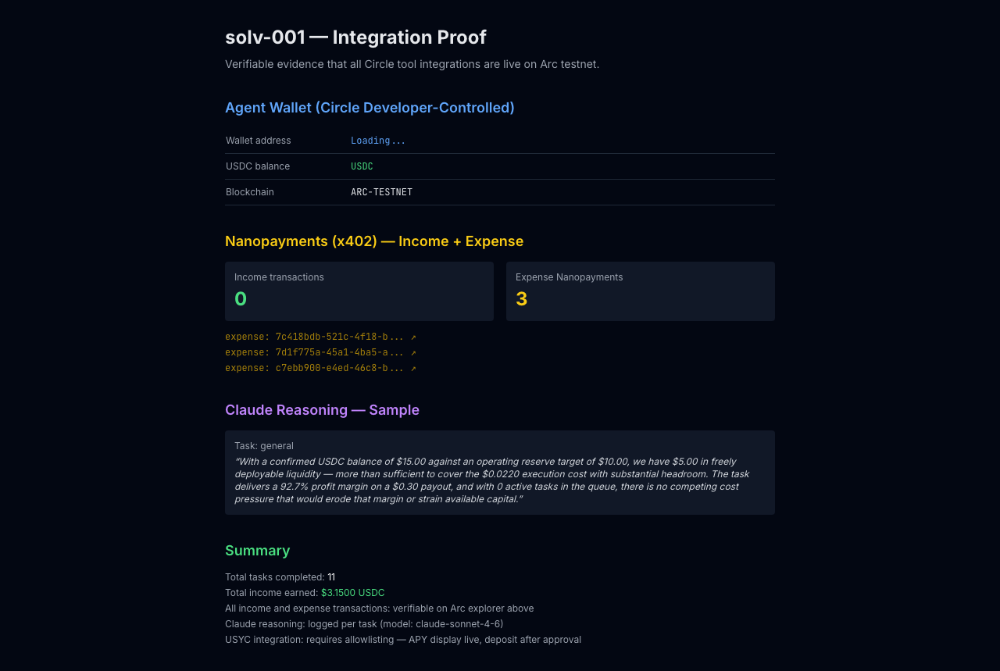

# solv-001: Self-Managing Financial Agent on Arc

An autonomous AI agent that earns USDC by completing tasks, reasons over its own treasury before deciding which tasks to run, and pays its operating costs as real Nanopayments on Arc — all verifiable on-chain.

[](https://www.typescriptlang.org/)
[](https://nextjs.org/)
[](https://developers.circle.com/)
[](LICENSE)

**Live:** [solv-001.vercel.app](https://solv-001.vercel.app) | **Proof:** [solv-001.vercel.app/proof](https://solv-001.vercel.app/proof)

---


## What It Does

solv-001 is a self-managing financial agent with four capabilities no rule-based agent has:

1. **It earns.** Clients pay per task in USDC via Circle Nanopayments (x402). Every payment is a real onchain transaction on Arc testnet.
2. **It reasons.** Before executing any task, Claude evaluates the live treasury — current USDC balance, pending receivables, USYC yield rate, and task profit margin — and decides whether to ACCEPT, DEFER, or REJECT. The reasoning streams character-by-character in the dashboard.
3. **It spends responsibly.** Every external data call is paid as a real Nanopayment, creating an immutable expense log on Arc.
4. **It saves.** Idle USDC above an operating reserve is automatically swept into USYC for yield.

## Circle Tools Used

| Tool | Role |
|------|------|
| Developer-Controlled Wallets | Agent treasury wallet — USDC custody and USYC position |
| x402 Nanopayments (Seller) | Income gate — every task requires a verified payment before execution |
| x402 Nanopayments (Buyer) | Expense tracking — every data API call is a paid Nanopayment on Arc |
| USYC Teller | APY display live (4.85%); idle capital sweep on task completion |

## Agentic Sophistication

The core loop:

```
Task arrives → Claude reads [balance, pending income, USYC yield, task margin] → ACCEPT / DEFER / REJECT → Execute → Record expenses as Nanopayments → Sweep idle USDC to USYC
```

Claude's reasoning is not a rule engine. It considers four live financial variables simultaneously and produces a plain-English explanation with specific numbers. Judges can watch the reasoning stream in real time.

## Try It (60 seconds)

1. Go to [solv-001.vercel.app](https://solv-001.vercel.app)
2. Make sure **Demo mode** is checked (no wallet needed)
3. Select task type: **contract summary** or **general**
4. Enter a task, e.g.: `Summarize the USYC teller contract at 0x9fdF14c5B14173D74C08Af27AebFf39240dC105A`
5. Click **run task** — watch Claude reason over the treasury, then execute

The full SSE stream takes ~15s. You'll see: treasury snapshot → Claude reasoning → nanopayment trace events → result.

## A2A / MCP Integration

```bash
# Discover capabilities
curl https://solv-001.vercel.app/api/agent-card

# Submit task (demo mode — no payment required)
curl -X POST https://solv-001.vercel.app/api/tasks \
  -H "Content-Type: application/json" \
  -d '{"task":"Summarize the USYC teller contract","task_type":"contract_summary","payer_wallet":"0x000...","demo_mode":true}'

# MCP endpoint (SSE transport)
# POST https://solv-001.vercel.app/api/mcp
```

## Architecture

```
Human / A2A / MCP Client
        ↓
POST /api/tasks (x402 Nanopayments gate)
        ↓
Treasury Reasoning Engine (Claude + live Circle Wallets state)
        ↓
Task Execution (arc-canteen CLI + Nanopayments buyer)
        ↓
Vercel Postgres (tasks + treasury_events + trace_log)
        ↓
Arc Testnet (income tx + expense nanopayments onchain)
```

**Stack:** Next.js 15, TypeScript, Tailwind, viem, @circle-fin/developer-controlled-wallets, @circle-fin/x402-batching, @modelcontextprotocol/sdk, @anthropic-ai/sdk, Vercel Postgres

## Local Setup

```bash
git clone https://github.com/dmustapha/solv-001
cd solv-001
npm install

# Copy and fill environment variables
cp .env.example .env.local
# Set: CIRCLE_API_KEY, CIRCLE_ENTITY_SECRET, CIRCLE_WALLET_ID, CIRCLE_WALLET_ADDRESS,
#      CIRCLE_USDC_TOKEN_ID, SELLER_EOA_ADDRESS, EXPENSE_WALLET_PRIVATE_KEY,
#      ANTHROPIC_API_KEY, POSTGRES_URL (from Vercel)

npm run dev
# Open http://localhost:3000
```

## Screenshots

| Dashboard | Proof of Payments |
|-----------|------------------|
|  |  |

## Arc Testnet

- Agent Wallet: [0x927c1d756d12879aebea0772f3ee220f21f4841a](https://explorer.arcnetwork.xyz/address/0x927c1d756d12879aebea0772f3ee220f21f4841a)
- USYC Teller: [0x9fdF14c5B14173D74C08Af27AebFf39240dC105A](https://explorer.arcnetwork.xyz/address/0x9fdF14c5B14173D74C08Af27AebFf39240dC105A)
- USDC: [0x3600000000000000000000000000000000000000](https://explorer.arcnetwork.xyz/address/0x3600000000000000000000000000000000000000)

---

Built for the [Agora Agents Hackathon](https://agora.thecanteenapp.com/) (Canteen × Circle × Arc) — May 2026.

## License

MIT
